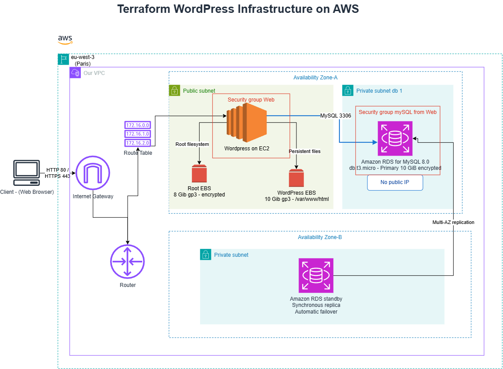

# Terraform WordPress on AWS

Terraform project that deploys a secure WordPress stack in **AWS Europe (Paris), `eu-west-3`**.

## Architecture

- One VPC with an Internet Gateway and public route table
- One public subnet containing an Amazon Linux 2 EC2 `t3.micro`
- Apache, PHP 8.2 and WordPress installed through EC2 `user_data`
- Encrypted 8-GiB root disk and separate 10-GiB EBS volume mounted at `/var/www/html`
- Two private database subnets in separate Availability Zones
- Encrypted MySQL 8.0 RDS `db.t3.micro` with Multi-AZ failover
- Web security group allowing HTTP `80` and optional HTTPS `443`
- RDS security group allowing MySQL `3306` only from the web security group
- Optional self-signed TLS certificate for demonstration purposes

The editable architecture diagram is in [`aws-wordpress-tf-infrastructure.drawio`](./aws-wordpress-tf-infrastructure.drawio). Open it with [diagrams.net](https://app.diagrams.net/).

See also here:


## Deploy

Prerequisites: Terraform, AWS CLI, configured AWS credentials and permission to create EC2, EBS, RDS and VPC networking resources.

```bash
terraform init
terraform fmt -recursive
terraform validate
terraform plan -var='environment=dev' -out=tfplan
terraform apply tfplan
```

Show the deployed endpoints:

```bash
terraform output wordpress_http_url
terraform output wordpress_https_url
```

For a self-signed HTTPS certificate, test TLS with:

```bash
curl -kI "$(terraform output -raw wordpress_https_url)"
```

## Destroy

Use the same environment and Terraform state that created the resources:

```bash
terraform plan -destroy -var='environment=dev' -out=tfplan-destroy
terraform apply tfplan-destroy
```

This permanently deletes the EC2 instance, WordPress EBS data, RDS database and networking resources. The current demonstration stack was successfully destroyed after testing.

## Environment safety

Keep `dev` and `prod` in separate Terraform state files or backend keys. Changing only the environment variable while reusing one state can cause Terraform to replace existing resources.